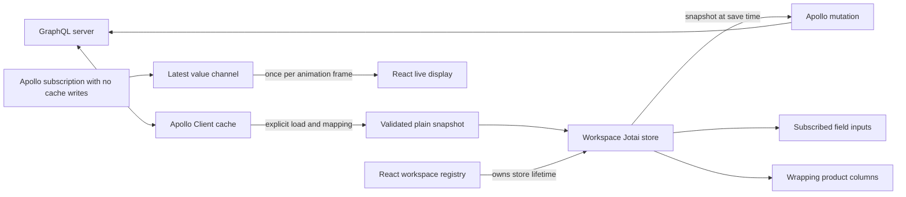

# Scoped editor architecture

Use Apollo Client for remote entities, Jotai for editable workspace drafts, React state for temporary UI state, and an external channel for high-rate display values. The separation of ownership is more important than the state library.

## What the original proof of concept gets right

The original implementation uses access-tracked snapshots to avoid unrelated React renders. It also keeps the live stream outside the editable proxy. Both ideas are useful and carry into this design.

The problems are in ownership and lifecycle:

- Shared values exist in both the header and every row. Pairs of reactive effects propagate writes in both directions, multiplying work and making the order of writes significant.
- Factories create subscriptions and timers, retain their parent state, and discard disposal functions. Inactive workspaces keep producing updates.
- UI mounts create persistent rows. Switching tabs remounts a view and can create extra rows; the custom mount hook also suppresses React's effect replay without handling cleanup.
- A temporary state property acts as a bulk command. Writing then clearing it relies on effect scheduling; identical repeated commands and clearing are difficult to express. The input explicitly ignores empty drafts.
- Writes use arbitrary string paths and `unknown` values with type errors suppressed. These paths can manufacture intermediate objects and bypass invariants.
- Validation is stored through reactive effects, while the aggregate validity flag is never maintained. Every field reads through the workspace snapshot, introducing broad subscription work even if React later skips a render.
- Store instances, actions, preferences, persistence, and devtools live in a module singleton with circular imports. There is no serializable boundary for loading or saving a draft.

Changing the library alone would preserve these problems.

## Ownership and flow



The registry holds stable workspace instances and renders only the active editor. A factory creates one initial row and has no external effects. Switching tabs changes the visible provider, not the data. Closing a workspace releases the registry reference; unmounting stops the live source and removes subscriptions. Closing a modified draft requires confirmation. Drafts are currently memory-only; the preference toggle alone uses versioned optional local storage.

Each workspace owns a Jotai store created with `createStore`. Atoms are created inside that factory. The React provider receives that store explicitly. There is no application-wide editable store or permanent atom-family registry.

The two shared text fields each have **one canonical value**. All header and row inputs read and write the same field atom. A shared edit necessarily updates each mounted view of that field, but makes one state write and performs one shared validation. Rows store only their independent level values. This preserves the original linked-field behavior; adding per-row overrides would be a separate explicit rule.

Each text field has a typed writable value atom and a derived error atom. The underlying state is private. Editable values remain strings, preserving incomplete user input; schema-specific conversions belong at the server mapping boundary. Row setters guard against writes through references to removed rows. Structural changes use explicit commands; the row collection identity stays stable while typing.

Validity is derived per field. An incremental count records transitions between valid and invalid row fields. The summary combines that count with the two canonical field errors. It counts unique invalid fields, so one shared error counts once even when displayed in many rows. It does not scan the full row list on a keystroke. Randomized tests check the count against a separately computed snapshot oracle.

Bulk edits are write transactions, not persistent state or effects. They set each current row's value, including empty strings. A repeated command still updates any row independently edited since the preceding command. New rows start empty; an old command does not become an implicit default.

## Costs and scaling

| Operation | State work | Rendering work |
| --- | --- | --- |
| One local field edit | Constant dependency neighborhood; no row-list copy | Edited field and changed summary, if applicable |
| Shared field edit | One canonical write and validation | Mounted consumers of that field |
| Bulk level command | O(number of rows), batched | Mounted changed fields; summary once |
| Add/remove rows | O(number of rows) collection update | Visible list and structural summary |
| Snapshot/export | O(number of rows), on demand | None |
| Live message | Constant work; retain latest value | At most one display notification per animation frame |

The UI preserves the parent hierarchy: deal tabs, a deal toolbar, one deal column with shared and broadcast fields, and N product columns that wrap with the available width. The internal draft model retains generic row/field names; its rows are rendered as product columns. Virtualization groups columns into 580px rows, with 560px cards, and bounds mounted views to the viewport and overscan. The leading group remains mounted so scrolling cannot dispose the deal live source or discard an uncommitted broadcast. Product identity uses stable IDs, not array indexes. Changing card content to variable heights requires measuring groups. Large calculations should run outside render, and sustained expensive work can move to a worker after measurement. A store change cannot fix an unbounded DOM tree.

The live channel has two values: the latest received value and the last published display snapshot. It receives every value but deliberately coalesces **display** notifications. It is unsuitable for an ordered event ledger or calculations requiring every message; route those through a separate event processor before publishing a display value. All snapshots are primitives and remain stable between changes, as required by React's external-store subscription contract.

## Apollo integration

`src/data/apolloGateway.ts` accepts an existing Apollo client and three generated typed operations with variable and response mappings. No endpoint, credentials, schema, or transport protocol is guessed. The running app uses a local demo source because the repository contains no server schema or connection configuration.

Use the host application's generated documents and map them at this boundary:

```ts
const gateway = createApolloGateway(client, {
  load: {
    document: LoadWorkspaceDocument,
    variables: (id: string) => ({ id }),
    read: mapLoadedWorkspace,
  },
  save: {
    document: SaveWorkspaceDocument,
    variables: mapSaveVariables,
    read: mapSavedWorkspace,
  },
  live: {
    document: LiveWorkspaceDocument,
    variables: (id: string) => ({ id }),
    read: mapLiveValue,
  },
});
const workspace = createWorkspace(await gateway.load(id));
const source = gateway.liveSource(id); // Pass with a channel to the visible editor.
await saveWorkspaceDraft(workspace, gateway.save);
```

These names illustrate the integration; supply documents generated from the actual schema. The adapter does not configure a second Apollo cache or WebSocket client. Configure entity identity, transport, authentication, and reconnect policy in the host's existing client.

Queries use `network-only` so an explicit load refreshes remote data and populates Apollo's cache. The returned object is validated and copied into a draft once. There is no cache-to-draft synchronization effect: a refetch or subscription must never silently replace local edits. To refresh a draft, load a new snapshot and deliberately replace/reconcile the editor instance after resolving dirty state.

Mutations use Apollo's standard cache behavior. Supply the host client's cache policies or mutation updates for list membership; normalization alone does not insert new IDs into every list. Remote entity changes remain in Apollo. Drafts do not duplicate that remote entity cache.

Display-only subscriptions use `no-cache` to avoid normalized-cache writes and watcher work for every message. If a message changes a remote entity that other views require, process it through the appropriate Apollo cache update separately. Errors in Apollo 4 subscription results arrive through `next`; the adapter handles those, mapping failures, transport errors, and stream completion. Its source returns `unsubscribe`, which the React view calls on pause, switch, and unmount.

The save helper captures a snapshot and edit revision before sending. It blocks overlapping saves for the same workspace. Failure leaves the draft dirty. Successful acknowledgement marks only the submitted revision saved, so later edits survive. If the server canonicalizes values, the helper returns that response and leaves the draft dirty for deliberate reconciliation. Response IDs must match the request. Client revisions are local edit counters, **not** server concurrency tokens: multi-user write protection requires an expected server revision and conflict handling in the supplied mutation mapping.

## Module map

| File | Responsibility |
| --- | --- |
| `src/state/workspace.ts` | Draft ownership, typed fields, validation, commands, plain snapshots |
| `src/state/liveValue.ts` | Frame-coalesced display subscription and a disposable demo source |
| `src/data/apolloGateway.ts` | Typed Apollo boundary and save acknowledgement |
| `src/App.tsx` | Workspace registry and optional UI preference |
| `src/components/WorkspaceEditor.tsx` | Scoped provider and deal toolbar |
| `src/components/DealColumn.tsx` | Shared fields, broadcast, live value, and aggregate status |
| `src/components/ProductColumn.tsx` | Independent product controls sharing canonical parent fields |
| `src/components/ProductColumns.tsx` | Responsive wrapping columns, group virtualization, and stable product identity |
| `src/components/TextInput.tsx` | Narrow field subscriptions and accessible errors |
| `src/components/BroadcastInput.tsx` | Temporary draft and explicit commit |
| `src/components/LiveValueField.tsx` | React external-store display and source lifecycle |

Add a new independent field by defining its typed field and validation in the model, including it in snapshots, and rendering the same small input component. Add derived behavior as a read atom, and cross-field changes as one explicit write command. Avoid bidirectional effects, global mutable singletons, and arbitrary path setters.

## Verification

The test suite covers a 1,000-input React render probe, independent workspace drafts, stable collection identity, atomic broadcasts, repeated and empty commands, removed-row references, randomized validation operations, snapshot round trips, save races, failures, canonicalization, Strict Mode cleanup, and 10,000-message bursts. Apollo boundary tests use an actual Apollo client with a controlled link, including GraphQL errors and cache isolation.

Browser verification exercised 1,001 products in the restored column UI, including broadcast values at the bottom of the virtual grid and responsive wrapping. At a 1,280px viewport, seven product columns were mounted initially; at a 600px viewport, two columns fit per group and five product columns were mounted. The deal column stays mounted while scrolling. Tests cover hierarchy preservation, broadcasts to offscreen products, and edit retention after scrolling away and back. The development page loaded without an error overlay or page errors. Store microbenchmark timings are recorded separately and should not be interpreted as browser interaction latency.

## References

- [Jotai store API](https://jotai.org/docs/core/store) and [provider scoping](https://jotai.org/docs/core/provider)
- [Jotai performance guidance](https://jotai.org/docs/guides/performance)
- [Valtio access-tracked snapshots](https://valtio.dev/docs/api/basic/useSnapshot)
- [Zustand scoped stores](https://zustand.docs.pmnd.rs/learn/guides/initialize-state-with-props)
- [React external-store subscriptions](https://react.dev/reference/react/useSyncExternalStore)
- [Apollo cache ownership](https://www.apollographql.com/docs/react/caching/overview) and [subscription behavior](https://www.apollographql.com/docs/react/data/subscriptions)
- [TanStack React Virtual](https://tanstack.com/virtual/latest/docs/framework/react/react-virtual)
